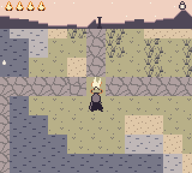
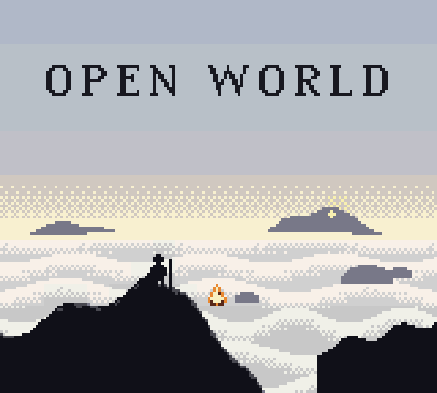
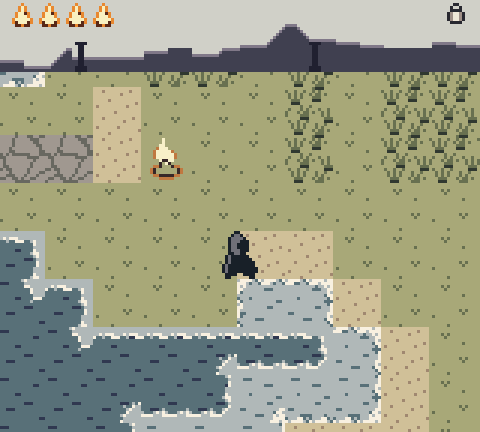
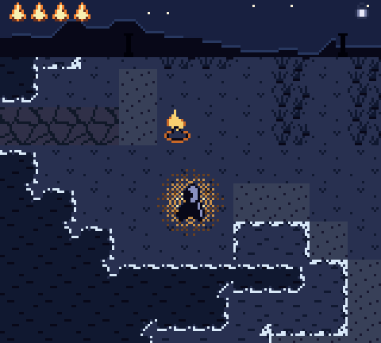
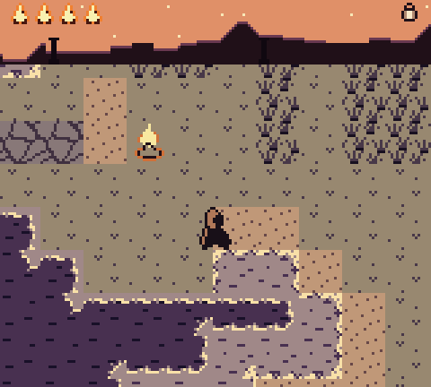
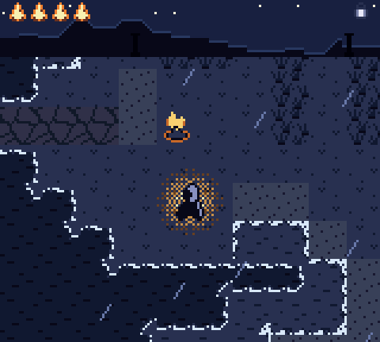
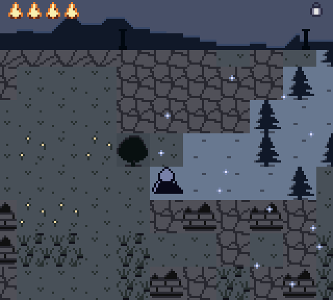
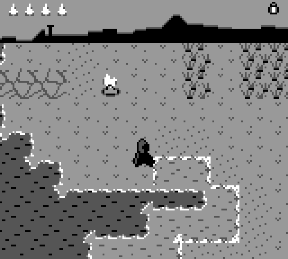
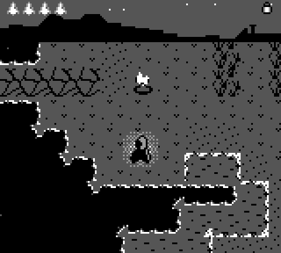
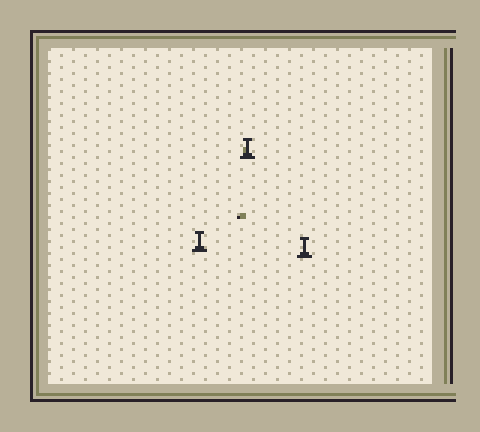

<h1 align="center">OPEN WORLD</h1>

<p align="center">
  <b>A wordless, procedurally generated wandering game for the Game Boy and Game Boy Color.</b><br>
  <i>The screen is a window, and the world goes on past it.</i>
</p>

<p align="center">
  
</p>

<p align="center">
  
  
  
</p>

---

You wake beside a cold fire. Far off, on the horizon, three dark pillars stand against the sky.

There is no dialogue, no story text, no numbers and no combat. The only words in the cartridge
are the title. Each world is generated from a 16-bit seed, is 65,536 × 65,536 cells in size,
and wraps at the edges.

Light the three **beacons**. Each is guarded differently: brambles, open water, a ring of crags.
Each one gives you what you need for the next. When all three burn, a fourth light rises on the
horizon: **the Heart**. Walk to it and sit down. The world dissolves and a new one begins, and
the cairns you built are still standing in it as ancient ruins.

## The idea

- **Friedrich's *Wanderer above the Sea of Fog*.** A small figure seen from behind, facing
  something too large to measure: the Sublime. A 160×144 screen can't *show* that, only imply
  it, so the game treats the small screen as a window and the world as whatever the frame leaves
  out.
- **The horizon band is the compass.** The top 24 pixels are a 360° panorama of distant
  mountains, turning as you turn, with the beacons, the Heart and your nearest cairn standing
  on it at their true bearings. You steer by landmarks, not by arrows.
- **Only light stays light.** Colour 0 is reserved for light: fire, beacons, stars, foam and
  glints. At night the palette crushes everything else toward black, so the land disappears and
  the lights remain. The lantern throws a soft dithered ring around you.
- **Design by subtraction** (after Ueda) and ***ma*** (meaningful empty space). Wide empty
  ground counts as composition.
- **Generative ambient sound** (after Eno). Loops of unequal prime lengths in a different mode
  for each biome, so the music never repeats exactly. Each lit beacon adds a tone. At the Heart
  the tones finally resolve.
- **It respects your time.** One beacon fits a 10-20 minute sitting, and the game saves at every
  fire. You can't lose progress: if your warmth runs out, you wake at the last fire you lit.

<p align="center">
  
  
  
</p>
<p align="center">
  
  
  
</p>

## Play it

- **Real hardware** (Game Boy, Pocket, Color, ModRetro Chromatic, Analogue Pocket…) with an
  **EverDrive**: download the `.gb` from **[Releases](../../releases/latest)** and follow
  **[docs/EVERDRIVE.md](docs/EVERDRIVE.md)**.
- **Emulator:** open the `.gb` in SameBoy, mGBA, Gambatte, BGB or Emulicious.

There is only ever one release: the latest build. Its tag is the build date (`YYYY.MM.DD`).

### Controls

| Button | Action |
| --- | --- |
| D-pad | Walk (8 directions) |
| **B** (hold) | Run |
| **A** | Use the item you are holding on whatever is in front of you; next to a fire, sit |
| **SELECT** | Switch item |
| **START** | Map (only the places you have walked) |
| *stand still* | After a few seconds the wanderer sits. Near a fire, time passes quickly. |

On the title screen, **A** continues. To begin a new world over an existing save, **hold SELECT**
until the flame goes out.

### What you carry

| Item | Found | Verbs |
| --- | --- | --- |
| Lantern | from the start | light fires and beacons, burn brambles, glow at night |
| Stones | the shrine at the first beacon | build a cairn (you can see it on the horizon and the map, and it carries into the next world), make stepping stones across shallows, pick your cairns back up. They refill at fires. |
| Cloak | the shrine at the second beacon | glide three cells over rock, water or thorns |

A small pictogram bobs over anything the item in your hand can act on.

### Warmth, night and weather

- **Warmth.** Four embers at the top left. You lose them at night away from fire, faster on snow,
  in the desert and in the rain. Fires and beacons warm you, and so, slowly, does the day. If you
  run out, the screen turns white and you wake at the last fire you lit.
- **Day length.** A day lasts eight minutes: dawn, day, dusk and night.
- **Weather** is the same for everyone in the same place on the same day: rain, snow, fog, storms.
- **The Watchers.** At night, and out in the ash and glass, tall pale figures stand in the fields.
  They drift toward your light. Tall grass and undergrowth hide you. They never come near a fire.

## Under the hood

The game is written in C with [GBDK-2020](https://github.com/gbdk-2020/gbdk-2020), with SM83
assembly where timing matters. The cartridge is **MBC5 + RAM + battery**, CGB-enhanced: it runs
in colour and at double speed on a Game Boy Color, and it is fully playable on a 1989 DMG.

**Two tile maps in one frame.** Lines 0-23 show the horizon band from BG map `0x9C00`, with its
own scroll. A raw assembly STAT interrupt at LYC=23 waits for HBlank and switches LCDC to map
`0x9800` and the land's scroll. The tests compare the split line pixel by pixel against VRAM.

**An endless world streamed through a 32×32 ring.** New columns and rows of 16×16 cells are
generated in the main loop and published in one step to a queue, which assembly drains into VRAM
(tiles plus CGB attributes) during VBlank. The screen never tears. The game logic itself runs from
the VBlank interrupt, so movement stays at 60 fps even when generation is slow.

**Autotiled shores.** Each quarter of a water cell is chosen from its three neighbours in that
corner's direction (straight edge, vertical edge, outer bay or inner bite). The fix-up pass runs
one line behind the streaming edge, where all the neighbours are known.

**The generator** (`src/core/`) is portable C that builds with both SDCC and gcc:
- **Terrain.** Integer value noise from a permutation-table hash: two octaves of elevation, plus
  moisture and "strangeness". A biome lookup table turns those into ten biomes: sea, shallows,
  shore, meadow, forest, desert, tundra, rock, ash/glass and ruins.
- **Points of interest.** One per 16×16 cell: fires, monoliths, ruins, a table set for two, a well.
- **Set pieces.** The three beacons and the Heart, each with its gate ring. Ancient causeways run
  to them and are forced solid wherever they cross water or rock, so every world can be finished.
- **Cost.** The hot path lives in bank 0 in about 5 KB. The generator's setup code is banked.

**Determinism is tested on both machines.** A test ROM runs the SDCC build of the core in PyBoy
and compares it cell by cell with the gcc build over six seeds and many regions. It caught a real
SDCC 4.3 miscompile, which is now worked around.

**Night glow.** Eight sprites, flipped on X and Y, form a dithered 32×32 ring of light around the
wanderer. It stays within the 10-sprites-per-line limit even in rain, and a test checks that.

**Sound.** A custom 4-channel generative engine:
- Channel 3 (wave): a drone for each biome.
- Channel 1: sparse phrases from six prime-length loops.
- Channel 2: a detuned ping-pong echo of channel 1.
- Channel 4: wind, surf and rain.

There are 21 sound effects, which borrow channels and hand them back cleanly. The engine uses
about 300 M-cycles per frame.

```
src/core/   portable world core (SDCC + gcc)
  world.c       hot path: world_mt, biomes, block cache, mods          [bank 0]
  world_gen.c   layout, set pieces, causeways, POIs, bearings          [banked]
src/gb/     Game Boy front end
  gfx.c isr.s land.c   ISRs, band/land split, streaming ring, blit queue  [bank 0]
  game.c player.c band.c fx.c pal.c map.c watchers.c save.c               [banked]
  sound.c sound_core.c   generative ambient engine + sfx
  assets.c      generated tiles, sprites, palettes, title                [banked]
assets/     hand-editable ASCII-art tiles, sprites, palettes
tools/      gen_assets.py · preview_assets.py · gen_music.py · render_audio.py
            owgen.c (host CLI for the world) · autopilot.py (plays a whole world) · screenshots.py
tests/      host tests, SDCC-vs-gcc core equivalence, PyBoy ROM tests, full playthrough
```

### Build

You need GBDK-2020 4.3 (at `/opt/gbdk`, or set `GBDK_HOME`), gcc, Python 3, and
`pip install pyboy pillow numpy` for the emulator tests.

```sh
make rom          # -> build/open-world.gb (+ .sym)
make test         # everything below
make test-host    # C unit tests: world core (~22k checks) + sound engine (~4.8k)
make test-assets  # asset pipeline
make test-rom     # PyBoy on DMG + CGB: ROM tests, core equivalence, playthrough
make screenshots  # regenerate docs/screens
```

`build/owgen` puts the world on your command line:

```sh
build/owgen layout 4660              # where the fire, beacons and Heart are
build/owgen show 4660 32768 32768    # ASCII map of a region
build/owgen stats 1 64               # biome mix, distances, reachability over 64 seeds
```

### Tests

- **World core:**
  - determinism;
  - biome mix;
  - set pieces;
  - reachability with each set of items over 220 seeds, including checks that each gate
    really blocks you until you have its item;
  - mods and bearings.
- **Sound:** a fake APU checks every biome × phase × weather combination and every mode and
  effect. It also checks that channels are borrowed and returned, that wave RAM is written only
  while the channel is off, and a 200k-frame stress run.
- **ROM, DMG and CGB:**
  - the streamed land matches the host generator (tile by tile, including shore edges) after
    walking and running in every direction;
  - the split line is clean;
  - collision;
  - lighting fires and beacons, shrines, cairns, stepping stones and gliding;
  - whiteout and respawn;
  - the map;
  - a save round trip, and recovery from a torn save;
  - the ending;
  - the Watchers;
  - no frame drops;
  - at most 10 sprites per line.
- **Playthrough:** an autopilot plays a complete world using **button inputs only**. It
  pathfinds with the host generator and steers by reading the player's position. Every leg is
  timed, and the world has to end with a new one beginning.

### CI and releases

[GitHub Actions](.github/workflows/ci.yml) installs GBDK, runs every test and uploads the ROM as
an artifact. When a push to the default branch passes, it publishes a release **tagged with the
date** and **deletes every older release**, so there is only ever one: the latest.

More design notes are in **[docs/DESIGN.md](docs/DESIGN.md)**, and the playtest results are in
**[docs/QA_REPORT.md](docs/QA_REPORT.md)**.

## License

MIT, see [LICENSE](LICENSE).
